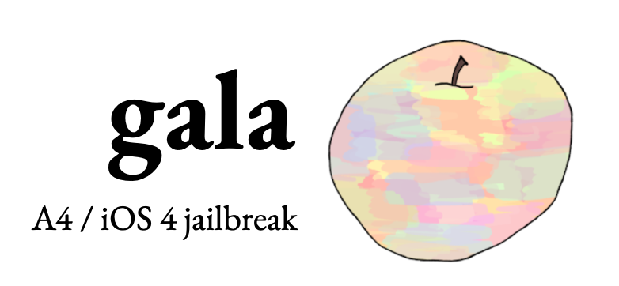
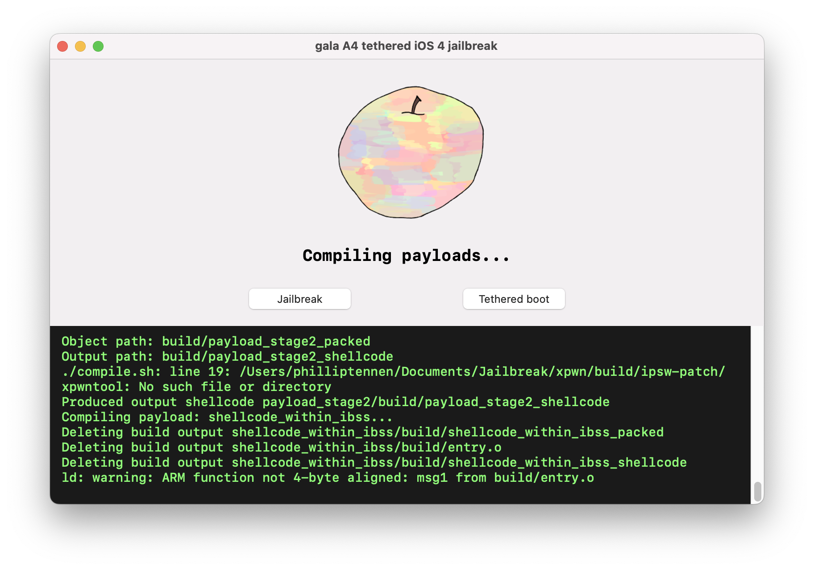
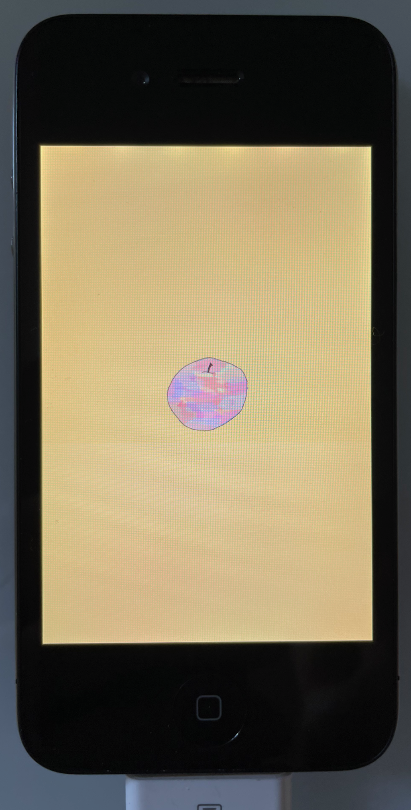
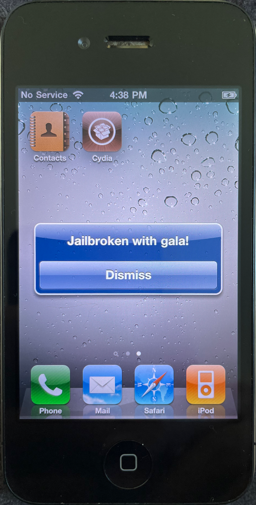
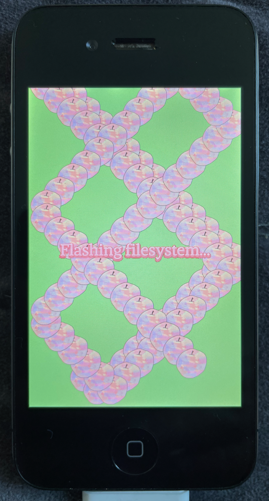

<div align="center">
  
</div>


**gala** is a jailbreak/tethered downgrade tool that currently supports iOS 4. **gala** implements [limera1n](https://www.theiphonewiki.com/wiki/Limera1n_Exploit) to gain code execution in SecureROM, then gradually boots and compromises the system from there.

**gala** comes with an [extensive write-up](https://axleos.com/blog/exploiting-the-iphone-4-part-1-gaining-entry/) on developing an iOS jailbreak.

**gala** provides the following user-facing features:

* Fully controlled bootchain and IPSW restore process
* Custom boot logos
* Kernel task can be controlled (`task_for_pid(0)`)
* Neutered sandbox
* Neutered code signing
* Any task can be root (`suser() == 0`)
* Enable `/dev/kmem` device file
* Disable FreeBSD MAC enforcement
* Allow RWX pages

<table align="center"> 
    <tr>
        <td></td>
    </tr>
</table>
<table align="center"> 
    <tr>
        <td></td>
        <td></td>
        <td></td>
    </tr>
</table>

**gala** implements a generic patching framework that emphasises maintainable and understandable patch sets. 

```python
    InstructionPatch(
        function_name="platform_early_init",
        reason="""
        The original logic loads a memory word to find the value to pass to debug_enable_uarts(). 
        We always want the debug logs to be emitted, so override the value here.
        """,
        address=VirtualMemoryPointer(0x84010b96),
        orig_instructions=[Instr.thumb("ldrb r0, [r4]")],
        patched_instructions=[Instr.thumb("movs r0, #3")],
    )
```

As a glance, the reader of this patch can clearly see exactly what's being replaced, and why.

`InstructionPatch` performs extensive validations to ensure the patch does exactly what's described in the metadata. For example, `InstructionPatch` will validate:

* That the replaced instructions exactly match what's expected in the patch.
* That disassembling the assembled patch instructions exactly matches what's written in the patch (in other words, that Capstone confirms that the in-house assembler produces the correct opcodes).
* That the exact correct number of bytes are patched based on the input and output instructions

Disassembly is performed via [Capstone](https://www.capstone-engine.org). New instructions are assembled with an in-house/ad-hoc assembler.

_Example: Injecting a shellcode program_

```python
    shellcode_addr = VirtualMemoryPointer(0x840000fc)
    BlobPatch(
        address=shellcode_addr,
        new_content=(RESOURCES / "shellcode").read_bytes(),
    )
```

**gala** uses [strongarm](https://github.com/datatheorem/strongarm) for Mach-O parsing during patching. **gala** relies on strongarm to find the appropriate file offset for the provided virtual address.

**gala** also provides `Patch` types that are especially convenient for producing custom iOS distributions. For example, it's straightforward to patch files that only exist within a mounted `.dmg`:

```python
    DmgPatchSet([
        DmgReplaceFileContentsPatch(
            file_path=Path("/private/etc/fstab"),
            new_content="""
                /dev/disk0s1 / hfs rw 0 1
                /dev/disk0s2s1 /private/var hfs rw,suid,dev 0 2
            """.encode()
        ),
        DmgApplyTarPatch(
            tar_path=_RESOURCES / "ssh_additions.tar"
        ),
    ])
```

# Installing gala

Set up a Python 3.11 virtual environment.

```bash
$ virtualenv -p python3.11 ./venv
# Or your preferred virtual environment manager
```

Install **gala's** Python dependencies.

```bash
$ pip install -r requirements.txt -r requirements-dev.txt
```

Set up **gala's** toolchain and the working tree. This will perform steps such as:

* Ensuring pre-dependencies (such as `git` and `rustup`) are installed.
* Installing the obsolete Rust nightly version that **gala** depends on.
* Building **gala's** forks of iOS interaction projects such as `idevicerestore`.
* Downloading and unzipping an iOS 4 IPSW from Apple.

```bash
$ invoke setup-toolchain
```

# Running gala

```bash
$ invoke launch-gui
```

# How gala works

**gala** comes with a [writeup](https://axleos.com/blog/exploiting-the-iphone-4-part-1-gaining-entry/) detailing the process of writing an iOS jailbreak. Here's what happens on the device at a high-level:

* The user places the device into DFU mode. 
* The device's SecureROM waits for an iBSS image to be uploaded over USB.
* **gala** sends a series of malformed USB control packets to upload and jump to shellcode.
* The shellcode takes over the process of waiting for an iBSS image, and embeds a runloop that will accept and load any unsigned image.
* **gala** uploads a patched iBSS that has its code signature checks patched out.
* The SecureROM loads and jumps to the patched iBSS.
* **gala** uploads a patched iBEC that has its code signature checks patched out. 
* The iBSS loads and jumps to the patched iBEC.
* **gala** uploads a patched Restore ramdisk, a patched kernelcache, and a device tree. 
* **gala** specifies boot arguments that indicate that the device should boot from the uploaded Restore ramdisk.
* The iBEC loads and jumps to the kernelcache. 
* The patched Restore ramdisk starts up a **gala**-owned service that communicates with **gala** on the host machine.
* **gala** sends a patched filesystem image over USB, and flashes it to the device.
* **gala** intentionally doesn't flash a new LLB to NOR. 
* The device reboots (and fails to boot, since the LLB sees that the boot-chain has an invalid code signature).

At this point, the device is jailbroken. The user then clicks the `Tethered boot` button, and the process is similar:

* The user places the device into DFU mode.
* The device's SecureROM waits for an iBSS image to be uploaded over USB.
* **gala** sends a series of malformed USB control packets to upload and jump to shellcode.
* The shellcode takes over the process of waiting for an iBSS image, and embeds a runloop that will accept and load any unsigned image.
* **gala** uploads a patched iBSS that has its code signature checks patched out.
* The SecureROM loads and jumps to the patched iBSS.
* **gala** uploads a patched iBEC that has its code signature checks patched out.
* The iBSS loads and jumps to the patched iBEC.
* **gala** uploads a patched Restore ramdisk, a patched kernelcache, and a device tree.
* **gala** specifies boot arguments that indicate that the device should boot from the filesystem on NAND.
* The iBEC loads and jumps to the kernelcache.
* The device boots to iOS.
